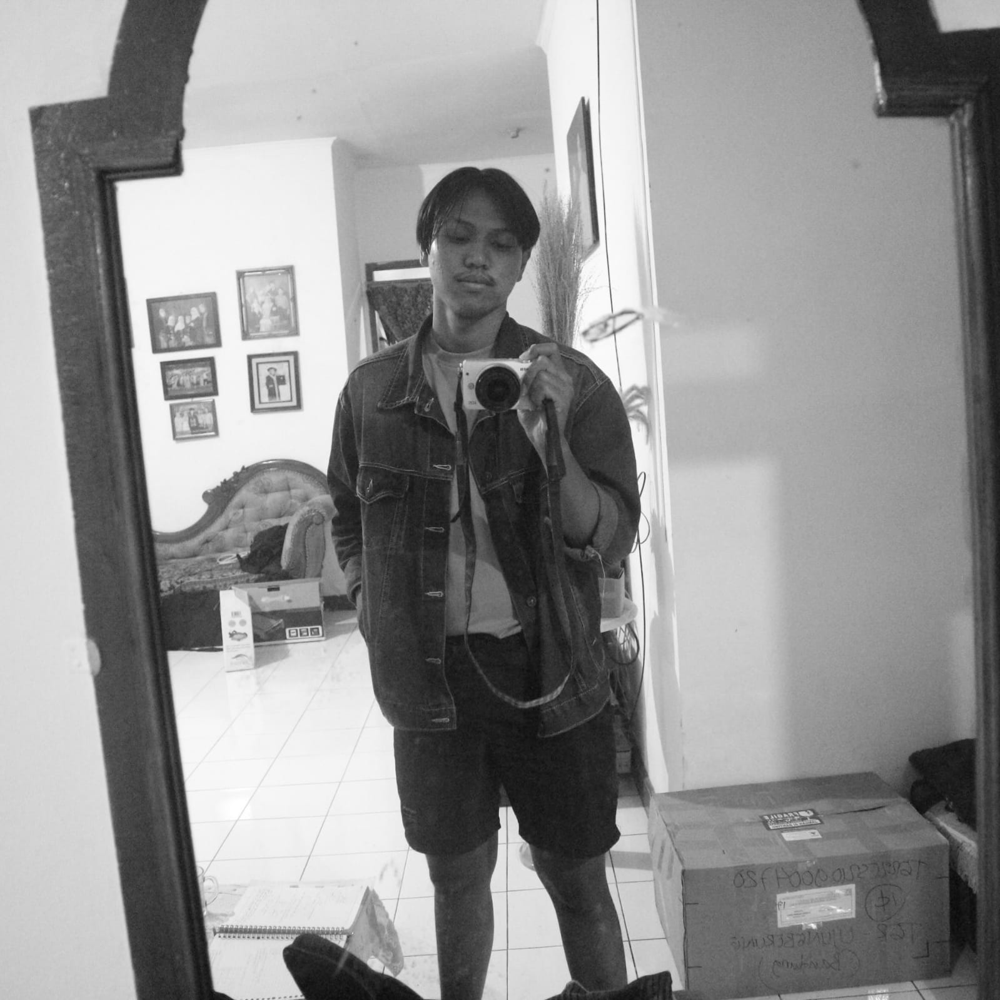

# Mental Health on Tech Workplaces

# Our Team

<div align='center'>




<br>

[](https://github.com/marssihsaan) 
  [](https://github.com/mrahmatmuhaimin) [](https://github.com/massodik) 
  <br> [Teknik Informatika](http://if.uinsgd.ac.id/) [UIN Sunan Gunung Djati Bandung](https://uinsgd.ac.id/) 

</div>

# Business Understanding

## Latar Belakang Masalah
Film merupakan sebuah karya seni sinematik gambar bergerak yang memiliki komponen cerita yang di dalam nya terdpaat komponen pelengkap seperti musik, seni rupa, fotografi, arsitektur, seni tari, seni puisi sastra, seni teater dan lainnya. Film merupakan karya seni yang sangat layak untuk dinikmati. Karena rasa dan emosi yang terkandung di dalam film bisa berdampak kepada psikologis dan perasaan manusia. Film banyak sekali genre atau jenisnya, dari mulai action, drama, fantasy, sci-fi, komedi, dan horor, semua bisa dinikmati. Sekarang ini, dunia perfilman sudah banyak berkembang. Dari tahun ke tahun film-film di luaran sana sudah bervariasi bentuknya. Ada yang bermain di sisi universenya mereka sendiri, ada yang bermain terhadap alur dan waktu, bahkan ada film yang bisa membuat seseorang berpikir keras terhadap jalan ceritanya. 

Variasi film sudah mulai banyak sekarang ini, berbagai judul sudah banyak dikeluarkan. Tetapi banyak orang di luaran sana, masih bingung menentukan mana film yang bagus, tidak bagus, dan biasa saja. Film yang kita maksud disini adalah film-film yang telah rilis dari cinema dan kita tahu film tersebut bagus. Walaupun dari berbagai sisi, film pasti memiliki kekurangan dan kelebihan nya masing-masing. Tapi kebanyakan orang akan merasa sangat sia-sia dan merasa telah membuang waktunya, apabila mereka menonton film yang tidak bagus.

## Solusi
Solusi yang kita hadirkan adalah membuat sebuah aplikasi list movie atau film-film recomended dan bagus yang hadir dari tahun ke tahun. Tujuanya adalah untuk menghilangkan sugesti mereka yang takut akan membuang waktu mereka yang sia-sia karena menonton film yang kurang bagus. Selain itu, user atau pengguna juga dapat melihat berbagai macam list film-film yang recomended dan mungkin menambahkan nya ke daftar tonton mereka.t

## Tujuan Teknis dan Kriteria Kesuksesan
1. Mengetahui gender para pekerja di bidang teknologi di United States yang lebih dominan mengalami gangguan mental 
2. Mengetahui pebadingan jumlah perusahaan yang menyediakan layanan kesehatan
3. Mengetahui pengaruh kesehatan mental terhadap keefektifan bekerja 
4. Mengetahui apakah para pekerja di bidang teknologi di United States ini sudah mendapatkan terapi pengobatan
5. Mengetahui rentang usia para pekerja di bidang teknologi di United States yang rentan mengalami gangguan mental

## Target Pasar Kami
1. Anak Muda 15-24 Tahun
2. Orang Dewasa 25-dst

## Market Pasar
Orang yang awam tentang film
Orang yang awam akan film harus mencoba aplikasi ini, agar tidak tersesat terhadap film yang ingin mereka tonton. Karena disini kita menambahkan sebuah deskripsi dan rating yang bisa dijadikan bahan acuan untuk menonton.

Pecinta film
Pecinta film mungkin sudah pasti tau segala sesuatu tentang film. Tapi dengan aplikasi ini, pecinta film mungkin ingin mencoba untuk me-rewatch film-film recomended yang ingin mereka tonton lagi.

Sineas-Sineas Baru
Sineas-sineas baru yang ingin mencoba untuk mendirect sebuah film, mungkin harus mencoba aplikasi ini sebagai acuan terhadap film yang mereka ingin buat nantinya.


## Getting Started

clone the app and go inside of root dir run
npm install

then
go inside rootDir/JsonServer (inside JsonServer dir) and run

npm install

then open this dir in terminal or command prompt and run
```
npm run tunnel //to start ngrok tunnel
```
then run
```
npm run db //to start database server
```
then copy ngrok tunnel forwarding url and past in App.js
```
url = "https://ae06fec9c1a7.ngrok.io" + 'route' //route(YOUR_DATABASE_OBJECT_KEY)
//LIKE -> https://ae06fec9c1a7.ngrok.io/posts
```

then run app
```
expo start
```
then select android/ios device to run the app from options

COOL!
